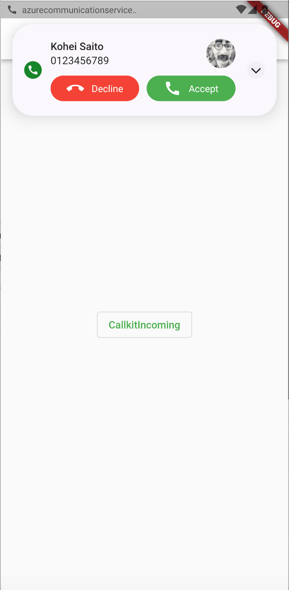

# Azure Communication Services with Flutter App

## アーキテクチャ

## コンテンツ

| File/folder | Description                           |
| ----------- | ------------------------------------- |
| backend     | バックエンド API ソースコード         |
| frontend    | モバイルアプリ (Flutter) ソースコード |
| images      | `README.md` で使われている画像        |

## 本サンプルの内容

発信者が電話をかけると、受信者にイベントが通知される。

## API パス

| Method | Path            | Description                                                  |
| ------ | --------------- | ------------------------------------------------------------ |
| POST   | /api/users      | ユーザー新規作成                                             |
| GET    | /api/acs        | Azure Communication Services の userId と accessToken を取得 |
| GET    | /api/users/{id} | id をもとに ユーザー取得                                     |
| PUT    | /api/users      | ユーザー更新                                                 |

## 構成設定

バックエンド API は下表のように定義する必要があります。

| Name                                | Description                                                            |
| ----------------------------------- | ---------------------------------------------------------------------- |
| AzureWebJobsStorage                 | Azure Functions のランタイムが使用するストレージアカウントの接続文字列 |
| FUNCTIONS_WORKER_RUNTIME            | Azure Functions で使用する言語                                         |
| NOTIFICATION_HUBS_CONNECTION_STRING | Azure Notification Hubs の接続文字列                                   |
| NOTIFICATION_HUBS_PATH              | Azure Notification Hubs で使用するパス                                 |
| COSMOSDB_ENDPOINT                   | Azure Cosmos DB エンドポイント                                         |
| COSMOSDB_KEY                        | Azure Cosmos DB プライマリキー                                         |
| ACS_ENDPOINT                        | Azure Communication Service エンドポイント                             |
| ACS_ACCESSKEY                       | Azure Cosmos DB アクセスキー                                           |

## 前提条件

本サンプルを使用する際は、以下の環境をセットアップしてください。

- [Flutter](https://docs.flutter.dev/get-started/install)
- [Java (OpenJDK 17)](https://openjdk.org/projects/jdk/17/)
