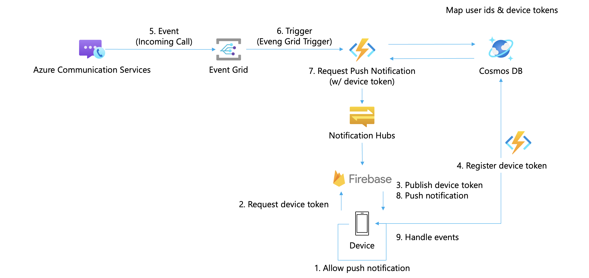
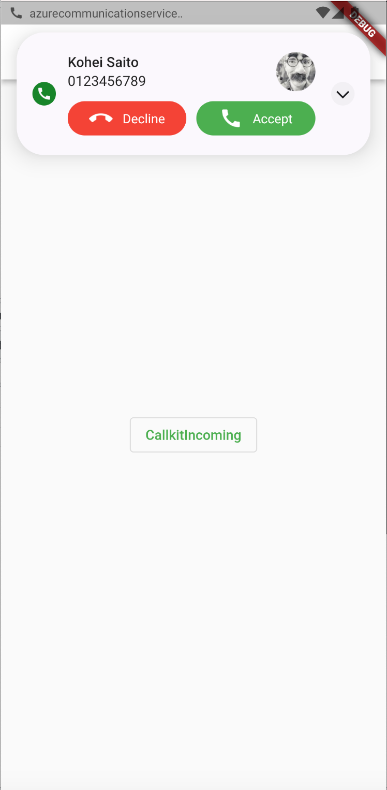

# Azure Communication Services with Flutter App

## Architecture

## Contents

| File/folder | Description                      |
| ----------- | -------------------------------- |
| backend     | Backend API source code          |
| frontend    | Mobile app (Flutter) source code |
| images      | Images used in `README.md`       |

## How this sample works

When a caller starts calling, the callee gets events on his/her device.

## API Paths

| Method | Path            | Description                                             |
| ------ | --------------- | ------------------------------------------------------- |
| POST   | /api/users      | Create a new user                                       |
| GET    | /api/acs        | Get Azure Communication Services userId and accessToken |
| GET    | /api/users/{id} | Get a user by userId                                    |
| PUT    | /api/users      | Update a user                                           |

## Configuration

The API is configured via the variables in the table below.

| Name                                | Description                                                                                   |
| ----------------------------------- | --------------------------------------------------------------------------------------------- |
| AzureWebJobsStorage                 | The Azure Functions runtime uses this storage account connection string for normal operation. |
| FUNCTIONS_WORKER_RUNTIME            | The language worker runtime to load in the function app.                                      |
| NOTIFICATION_HUBS_CONNECTION_STRING | Azure Notification Hubs connection string.                                                    |
| NOTIFICATION_HUBS_PATH              | Azure Notification Hubs path.                                                                 |
| COSMOSDB_ENDPOINT                   | Azure Cosmos DB endpoint.                                                                     |
| COSMOSDB_KEY                        | Azure Cosmos DB primary key.                                                                  |
| ACS_ENDPOINT                        | Azure Communication Service endpoint.                                                         |
| ACS_ACCESSKEY                       | Azure Cosmos DB access key.                                                                   |

## Prerequisites

When you use this sample, you have to set up the below environment.

- [Flutter](https://docs.flutter.dev/get-started/install)
- [Java (OpenJDK 17)](https://openjdk.org/projects/jdk/17/)
